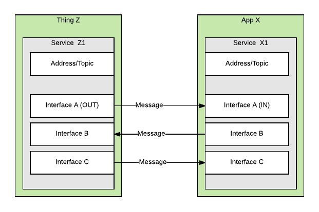

# FIMP framework 

## Service cocept.
FIMP framework is based on everything-is-a-service concept . 

 

## Component discovery mechanism.  

The mechanism allows dynamically discover different system component like adapters and application .  

[Component discovery flow and messages ](component-discovery.md) 

## Adding / removing things to FH system. 

Things can be added to FH ecosystem in 2 ways :

1. [Adding/removing a thing to FH system via adapter](thing-management.md)
2. [Connecting/disconnecting a system to FH system](system-management.md)

First method should be used to add a thing which isn't paired with underlying RF module , for instance: Z-Wave , Zigbee , Bluetooth 
 
Second method should be used to connect a system which already has a number of connected devices , for instance: Ikea Tradfri , Philips Hue , Sonos , etc. 

Example : add zwave device , remove zwave device , add zigbee device , remove zigbee device .

## Services.

#### Basic service 
Service name : **basic**

Description  : Meaning of **basic** service can vary from device to device . It's generic and most simple way to interact with a device . 

Type  | Interface                | Value type | Description 
------|--------------------------|------------|------------
out   | evt.lvl.report           | int        | Reports level using numeric value 
in    | cmd.lvl.set              | int        | Sets level using numeric value 
in    | cmd.lvl.get_report       | null       | 

Topic example : `pt:j1/mt:evt/rt:dev/rn:zw/ad:1/sv:basic/ad:15_0`

***

#### Device/Thing system service 
Service name : **dev_sys**

Type  | Interface                  | Value type | Description 
------|----------------------------|------------|------------
out   | evt.config.report          | str_map    | Reports configurations in form of key-value pairs . 
in    | cmd.config.set             | str_map    | Sets configuration . Value is a key-value pairs.
in    | cmd.config.get_report      | str_array  | Requests service to respond with config report . If array is empty - report all parameters .
in    | cmd.config.get_supp_list   | null       | Requests service to respond with a list of supported configurations . 
in    | cmd.config.supp_list_report| str_map    | List of supported configurations . Key - config name , value - short description. 
out   | evt.group.members_report   | object     | Object structure {"group":"group1","members":["node1","node2"]} 
in    | cmd.group.add_members      | object     | Adds members to the group. Object has the same format as members_report
in    | cmd.group.delete_members   | object     | Object has the same format as report. 
in    | cmd.group.get_members      | string     | Value is a group name . 

*Notes:*
> z-wave configuration values should be in form <param_id>;size , for instance 12;2

> z-wave association memeber should be in form <node_id>_<endpoint_id> , for instance 10_0 

***

#### Output binary switch service 

Service name : **out_bin_switch** 

Description  : Wallplugs , relays , simple sirens , etc should be controlled over the service. 

Type  | Interface                | Value type | Description 
------|--------------------------|------------|------------ 
out   | evt.binary.report        | bool       | Reports true when switch is ON and false whenr switch is OFF 
in    | cmd.binary.set           | bool       | 
in    | cmd.binary.get_report    | null       | 

Topic example : `pt:j1/mt:cmd/rt:dev/rn:zw/ad:1/sv:out_bin_switch/ad:15_0`

***

#### Output level switch service 

Service name : **out_lvl_switch** 

Description  :  

Type  | Interface                | Value type | Properties                | Description 
------|--------------------------|------------|---------------------------|------------ 
out   | evt.lvl.report           | int        |                           |
in    | cmd.lvl.set              | int        | duration                  | props = {"duration":"5"} . Duration is in seconds , factory default is used is propery is not defined .  
in    | cmd.lvl.start            | string     | start_lvl,duration        | Start a level change. Value defines direction can be : up,down,auto 
in    | cmd.lvl.stop             | null       |                           | Stop a level change 
in    | cmd.lvl.get_report       | null       |                           |
in    | cmd.binary.set           | bool       |                           | true is mapped t 255 , false to 0

Descriptor properties : 
Name      | Value example   | Description 
----------|-----------------|-------------
min_lvl   | 0               | minimum value 
max_lvl   | 99              | maximum value 
sw_type   | on_off,up_down  | type of level switch

 
Topic example : `pt:j1/mt:cmd/rt:dev/rn:zw/ad:1/sv:out_lvl_switch/ad:15_0`

***

#### Meter service 
Service name : Refer to the table below.

Description  : Meters report consumption over the sevice . 

Type  | Interface                | Value type | Properties                | Description 
------|--------------------------|------------|---------------------------|------------- 
out   | evt.meter.report         | float      | unit , prv_data , delta_t | prv_data - previous meter reading , delta_t - time delta 
in    | evt.meter.reset          | null       |                           | Resets all historical readings . 
in    | evt.meter.get_report     | string     |                           | Value - is a unit . May not be supported by all meter .

Supported meter types and their units : 

Service name       | Units                               | Description 
 ------------------|-------------------------------------|------------
 meter_elec        | kWh,kVAh,W,pulse_c,V,A,power_factor | Electric meter 
 meter_gas         | cub_m,cub_f,pulse_c                 | Gas meter 
 meter_water       | cub_m,cub_f,galon,pulse_c           | Water meter 

Topic example : `pt:j1/mt:evt/rt:dev/rn:zw/ad:1/sv:meter_elec/ad:15_0`

Descriptor properties : 

Name      | Value example   | Description 
----------|-----------------|-------------
sup_units | W,kWh,A,V       | comma separated list of supported units .

***

#### Numeric sensor service 
Service name : Refer to the table below . 
  
Description :  

 Type  | Interface                | Value type | Properties                | Description 
-------|--------------------------|------------|---------------------------|------------- 
out    | evt.sensor.report        | float      | unit                      | 
in     | cmd.sensor.get_report    | string     |                           | Value is desired unit. Use empty value to get report in default unit .   

 Supported sensor type and their units :

 Service name       | Units                 | Description 
 -------------------|-----------------------|------------
 sensor_temp        | C, F                  | Temperature sensor
 sensor_gp          | % , NOM               | General purpose sensor  
 sensor_lumin       | Lux , %               | Luminance sensor
 sensor_power       | W,Btu/h               | Power sensor . Btu/h - British thermal unit per hour
 sensor_humid       | %,g/m3                | Relative humidity sensor
 sensor_veloc       | m/s,mph               | Velocity sensor
 sensor_direct      | deg                   | Direction sensor
 sensor_atmo        | kPa,ha                | Atmospheric pressure sensor . ha - inches of Mercury
 sensor_baro        | kPa,ha                | Barometric  pressure sensor . ha - inches of Mercury
 sensor_solarrad    | w/m2                  | Solar radiation
 sensor_dew         | C, F                  | Dew point sensor
 sensor_rain        | mm/h,in/h             | Rain rate sensor
 sensor_tidelvl     | m, ft                 | Tide level sensor
 sensor_weight      | kg, lbs               | Weight sensor
 sensor_voltage     | V, mV                 | Voltage sensor
 sensor_current     | A, mA                 | Current sensor
 sensor_co2         | ppm                   | CO2-level sensor
 sensor_co          | mol/m3                | Carbon Monoxide level sensor
 sensor_airflow     | m3/h,ft3/m            | Air flow sensor
 sensor_tank        | l,gal,m3              | Tank capacity sensor
 sensor_distance    | m,cm,ft               | Distance sensor
 sensor_anglepos    | %,degN,degS           | Angle Position sensor
 sensor_rotation    | rpm,Hz                | Rotation sensor
 sensor_seismicint  | EMCRO,LEIDO,MERC,SHDO | Seismic intensity sensor
 sensor_seismicmag  | MB,ML,MW,MS           | Seismic magnitude sensor
 sensor_uv          | index                 | Ultraviolet sensor
 sensor_elresist    | ohm/m                 | Electrical resistivity sensor
 sensor_moist       | %,kOhm,m3/m3,aw       | Moisture sensor
 sensor_freq        | Hz,kHz                | Frequency sensor
 sensor_accelx      | m/s2                  | Acceleration, X-axis
 sensor_accely      | m/s2                  | Acceleration, Y-axis
 sensor_accelz      | m/s2                  | Acceleration, Z-axis
 sensor_accelz      | m/s2                  | Acceleration, Z-axis
 sensor_watflow     | l/h                   | Water flow sensor
 sensor_watpressure | kPa                   | Water pressure sensor

Example message : [evt.sensor.report](json-v1/messages/examples/evt.sensor.report)

Descriptor properties : 

Name      | Value example   | Description 
----------|-----------------|-------------
sup_units | C,F             | comma separated list of supported units .

***

#### Contact sensor service 
Service name : **sensor_contact** . 
  
Description : Binary contact sensor , normally magnetic contact .

 Type  | Interface                | Value type | Description 
-------|--------------------------|------------|-------------------- 
out    | evt.open.report          | bool       | true - contact is open (window/door is open) , false - contact is closed .
in     | cmd.open.get_report      | null       |    

***

#### Presence sensor service 
Service name : **sensor_presence** . 
  
Description : Motion sensor or some other way of presence detection .

 Type  | Interface                | Value type | Description 
-------|--------------------------|------------|-------------------- 
out    | evt.presence.report      | bool       | true - presence detected .
in     | cmd.presence.get_report  | null       |    

***

#### Alarm services 
Service name : Refer to the table below 

Description : 

Type   | Interface                | Value type | Description 
-------|--------------------------|------------|-------------------- 
out    | evt.alarm.report         | str_map    | val = {"event": "temper_removed_cover","status": "activ"} 
in     | cmd.alarm.get_report     | ?          |    

Supported alarm types : 

 Service name      | Event                                   | Description 
-------------------|-----------------------------------------|------------
alarm_fire         | smoke ,smoke_test                       |
alarm_heat         | overheat,temp_rise,underheat            |
alarm_gas          | CO,CO2, combust_gas_detected            |
   alarm_gas       | toxic_gas_detected ,test,replace        |
alarm_water        | leak, level_drop, replace_filter        |
alarm_lock         | manual_lock,rf_lock,keypad_lock,        | TODO: move to doorlock service
   alarm_lock      | manual_not_locked, rf_not_locked        |
   alarm_lock      | auto_locked , jammed                    |
alarm_burglar      | intrusion,temper_removed_cover,         |
   alarm_burglar   | temper_invalid_code,glass_breakage      |
alarm_power        | on,ac_on,ac_off,surge,voltage_drop,     | TODO: move to power_supply service
   alarm_power     | over_current,over_voltage,              |
   alarm_power     | replace_soon,replace_now,charging,      |
   alarm_power     | charged,charge_soon,charge_now          | 
alarm_system       | hw_failure,sw_failure,                  | 
   alarm_system    | hw_failure_with_code,                   | 
   alarm_system    | sw_failure_with_code                    | 
alarm_emergency    | police,fire,medical                     | 
alarm_time         | wakeup,timer_ended,time_remaining       | 
alarm_applience    | program_started,program_inprogress,     | 
  alarm_applience  | program_completed,replace_filter ,      | 
  alarm_applience  | set_temp_error,supplying_water,         | 
  alarm_applience  | water_supply_err, boiling,              | 
  alarm_applience  | boiling_err,washing,washing_err         | 
  alarm_applience  | rinsing,rinsing_err,draining ,          | 
  alarm_applience  | draining_err,spinnning,spinning_err,    | 
  alarm_applience  | drying,drying_err,fan_err,              | 
  alarm_applience  | compressor_err                          | 
alarm_health       | leaving_bed,sitting_on_bed,lying_on_bed,| 
  alarm_health     | posture_change,sitting_on_bed_edge,     | 
  alarm_health     | volatile_organic_compound               | 
alarm_siren        | inactive,siren_active                   | 
alarm_water_valve  | valve_op,master_valve_op,               | 
  alarm_water_valve| valve_short_circuit,current_alarm       | 
  alarm_water_valve| master_valve_current_alarm              | 
 alarm_weather     | inactive,moisture                       | 

Example message : [evt.sensor.report](json-v1/messages/examples/evt.alarm.report.json)

Descriptor properties : 

Name       | Value example     | Description 
-----------|-------------------|-------------
sup_events | smoke ,smoke_test | supported events .

***

#### Battery service
Service name : **battery** . 
  
Description :  

 Type  | Interface                | Value type | Properties| Description 
-------|--------------------------|------------|-----------|------------------ 
out    | evt.lvl.report           | int        | state     | available states : charging,charged,replace,emtpy
out    | evt.alarm.report         | str_map    |           | val = {"event": "low_battery","status": "activ"}   
in     | cmd.lvl.get_report       | null       |           | Get battery level over level report . 
   
#### Thermostat service
Service name : **thermostat** . 
  
Description :  

 Type  | Interface                  | Value type | Properties| Description 
-------|----------------------------|------------|-----------|------------------ 
out    | evt.setpoint.report        | str_map    |           | val = {"type":"heating","temp":"21.5","unit":"C"}   
in     | cmd.setpoint.set           | str_map    |           | val = {"type":"heating","temp":"21.5","unit":"C"} 
in     | cmd.setpoint.get_report    | string     |           | value is a setpoint type 
in     | cmd.mode.set               | string     |           |  Set thermostat mode :
in     | cmd.mode.get_report        | null       |           |  
out    | evt.mode.report            | string     |           |  
out    | evt.state.report           | string     |           |  Reports operational state .
in     | cmd.state.get_report       | null       |           |  
   

Descriptor properties : 

Name           | Value example       | Description 
---------------|---------------------|-------------
sup_setpoints  | heating,cooling     | supported setpoints .
sup_modes      | off,heating,cooling | supported modes .
sup_states     | idle,heating,cooling| idle,heating,cooling,fan_only,pending_heat,pending_cool,vent

Modes : off, heat,cool,auto,aux_heat,resume,fan,furnace,dry_air,moist_air,auto_changeover,energy_heat,energy_cool,away
Setpoint types : heat,cool,furnace,dry_air,moist_air,auto_changeover,energy_heat,energy_cool,special_heat,

#### Door lock service 
Service name : **door_lock** . 
  
Description : Dorlock 

 Type  | Interface                | Value type | Properties | Description 
-------|--------------------------|------------|------------|------------------ 
out    | evt.lock.report          | bool_map   | timeout_s  | value = ["is_secured":true,"door_is_closed":true,"bolt_is_locked":true,"latch_is_closed":true]
in     | cmd.lock.set             | bool       |            | Use true to secure a lock and false to unsecure
in     | cmd.lock.get_report      | null       |            |
   
#### Color control service   
Service name : **color_ctrl** 

Description : The service has to be used to controll color components of a lightning device . 

Type  | Interface                | Value type |  Description 
------|--------------------------|------------|-------------------
in    | cmd.color.set            | int_map    | value is a map of color components . val= {"red":200,"green":100,"blue":45}
in    | cmd.color.get_report     | null       | The command is a request for a map of color component values 
out   | evt.color.report         | int_map    | Map of color components , where value is component intensity.
Descriptor properties :

Name           | Value example       | Description 
---------------|---------------------|-------------
sup_components | ["red","green","blue"]       | List of supported color comoponents 

Supported color components : red,green,blue,warm_w,cold_w,temp,amber,cyan,purple

Notes :
> temp - is color temperature in Kalvin. Value range 1000K-10000K .
> warm_w - is warm white light source intensity.Value range 0-255 .
> cold_w - is cold white light source intensity.Value range 0-255 .  
> Mix of warm white intensity and cold white intensity forms color temperature . 

#### Scene controller service
Service name : **scene_ctrl** . 
  
Description : The service represents a device which can be used to controll scenes . Normally it's remote controller . 

Type  | Interface                | Value type |  Description 
------|--------------------------|------------|-------------------
in    | cmd.scene.get_report     | null       | The command is a request for current scene .  
out   | evt.scene.report         | string     | Event is generated whenever scene button is pressed on controller.

Descriptor properties :

Name           | Value example       | Description 
---------------|---------------------|-------------
sup_scenes     | 1 , a , movies      | List of supported scenes  

#### Fan control service
Service name : **fan_ctrl** 

Description : The service has to be used to control a fan operational modes , speed and receive state opdates. 

Type  | Interface                | Value type |  Description 
------|--------------------------|------------|-------------------
in    | cmd.mode.set             | string     | Fan mode . Supported values : AUTO_LOW,AUTO_HIGH,AUTO_MID,LOW,HIGH,MID , HUMID_CIRCULATION , UP_DOWN,LEFT_RIGHT,QUIET
in    | cmd.mode.get_report      | null       | The command is a request for current fan mode report.
out   | evt.mode.report          | string     | Current fan mode 
out   | evt.state.report         | string     | Report operational state. Supported values : IDLE,LOW,HIGH,MID
in    | cmd.state.get_report     | null       | The command is a request for current fan state report  
in    | cmd.lvl.set              | int        | Fan speed , value 0 - 100 %   
in    | cmd.lvl.get_report       | null       | The command is a request for current fan speed level.
out   | evt.lvl.report           | null       | Current fan speed level.
in    | cmd.modelvl.set          | int_map    | val = {"MID":90,"AUTO_LOW":10} 
in    | cmd.modelvl.get_report   | string     | The command is a request for fan speed level for particular mode. If mode is set to "" , the device should report levels for all modes.
out   | evt.modelvl.report       | int_map    | val = {"MID":90,"AUTO_LOW":10} 

Descriptor properties :

Name           | Value example       | Description 
---------------|---------------------|-------------
sup_modes      | AUTO_LOW,AUTO_MID   | List of supported modes 
sup_states     | IDLE , LOW,HIGH     | 

