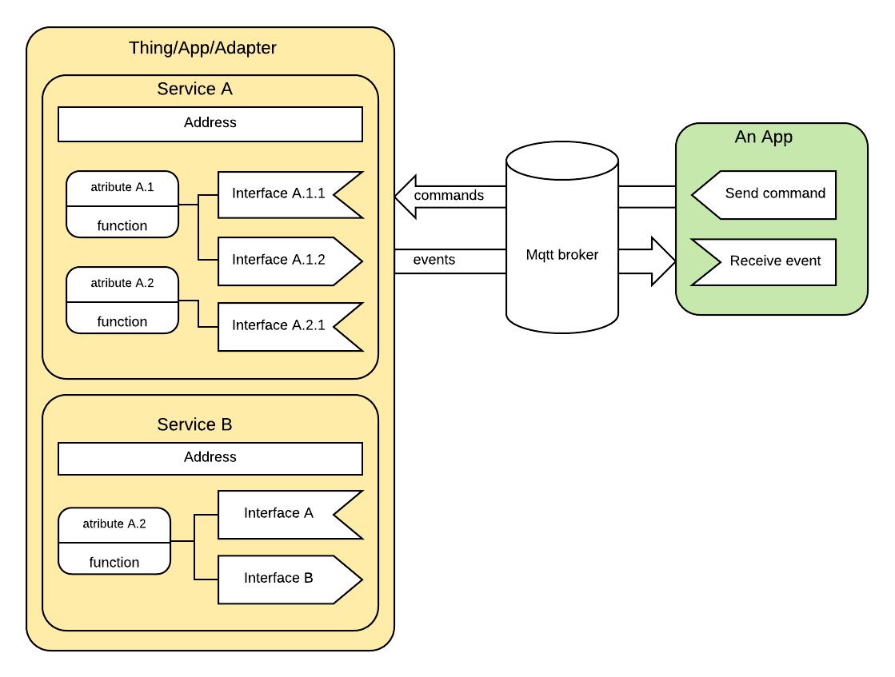
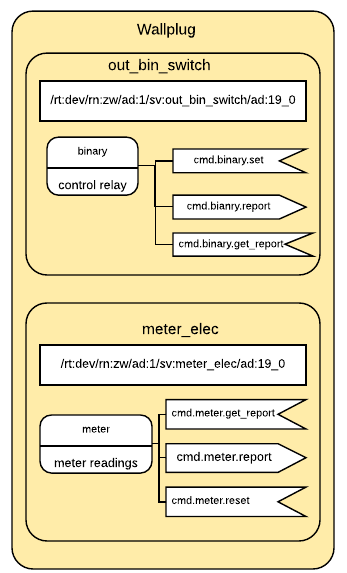

# Futurehome IoT Messaging Protocol - FIMP

## Service overview.

In FIMP, every device / app-functionality is represented as service. Every service should have at least one interface and at least one attribute. A service interacts with outer world by means of messages, it can either produce messages (events), receive messages (commands) but also in some cases it may send command. Each service has its own unique address (topic), all interfaces within the service share the same address. A service can't have more than one interface of the same type.

Abstract diagram:

Device example:

Message format:

[FIMP message format](message-format.md)

## Component discovery mechanism.

The mechanism allows dynamically discover different system component like adapters and application.

[Component discovery flow and messages](component-discovery.md)

## Adding / removing things to FH system.

Things can be added to FH ecosystem in 2 ways:

1. [Adding/removing a thing to FH system via adapter](thing-management.md)
2. [Connecting/disconnecting a system to FH system](system-management.md)

First method should be used to add a thing which isn't paired with underlying RF module, for instance: Z-Wave, Zigbee, Bluetooth

Second method should be used to connect a system which already has a number of connected devices, for instance: IKEA Trådfri, Phillips Hue, Sonos, etc.

Example: add z-wave device, remove z-wave device, add zigbee device, remove zigbee device.

## Services

### Basic service

A generic service and the most simple way to interact with a device. The actual meaning of "basic" varies from device to device.

#### Service names

`basic`

#### Interfaces

Type | Interface          | Value type | Description
-----|--------------------|------------|------------
out  | evt.lvl.report     | int        | Reports level using numeric value
in   | cmd.lvl.set        | int        | Sets level using numeric value
in   | cmd.lvl.get_report | null       |

Topic example: `pt:j1/mt:evt/rt:dev/rn:zw/ad:1/sv:basic/ad:15_0`

***

### System related device service

#### Service names

`dev_sys`

#### Interfaces

Type | Interface                   | Value type | Description
-----|---------------------------- |------------|------------
out  | evt.config.report           | str_map    | Reports configurations in form of key-value pairs.
in   | cmd.config.set              | str_map    | Sets configuration. Value is a key-value pairs.
in   | cmd.config.get_report       | str_array  | Requests service to respond with config report. If array is empty - report all parameters.
in   | cmd.config.get_supp_list    | null       | Requests service to respond with a list of supported configurations.
in   | cmd.config.supp_list_report | str_map    | List of supported configurations. Key - config name, value - short description.
out  | evt.group.members_report    | object     | Object structure {"group":"group1", "members":["node1", "node2"]}
in   | cmd.group.add_members       | object     | Adds members to the group. Object has the same format as members_report
in   | cmd.group.delete_members    | object     | Object has the same format as report.
in   | cmd.group.get_members       | string     | Value is a group name.

#### Notes

- z-wave configuration values should be in form <value>;size, for instance 12;2

- z-wave association member should be in form <node_id>\_<endpoint_id>, for instance 10_0

***

### Output binary switch service

Output binary switch service for wall-plugs, relays, simple sirens, etc.

#### Service names

`out_bin_switch`

#### Interfaces

Type | Interface             | Value type | Description
-----|-----------------------|------------|------------
out  | evt.binary.report     | bool       | Reports true when switch is ON and false when switch is OFF
in   | cmd.binary.set        | bool       |
in   | cmd.binary.get_report | null       |

Topic example: `pt:j1/mt:cmd/rt:dev/rn:zw/ad:1/sv:out_bin_switch/ad:15_0`

***

### Output level switch service

Used for dimmers and things generally controlled with sliders.

#### Service names

`out_lvl_switch`

#### Interfaces

Type | Interface          | Value type | Properties          | Description
-----|--------------------|------------|---------------------|------------
out  | evt.lvl.report     | int        |                     |
in   | cmd.lvl.set        | int        | duration            | props = {"duration":"5"}. Duration is in seconds, factory default is used is propery is not defined.
in   | cmd.lvl.start      | string     | start_lvl, duration | Start a level change. Value defines direction can be: up, down, auto
in   | cmd.lvl.stop       | null       |                     | Stop a level change
in   | cmd.lvl.get_report | null       |                     |
in   | cmd.binary.set     | bool       |                     | true is mapped to 255, false to 0
out  | evt.binary.report  | bool       |                     |

Topic example: `pt:j1/mt:cmd/rt:dev/rn:zw/ad:1/sv:out_lvl_switch/ad:15_0`

#### Props

Name    | Value example   | Description
--------|-----------------|-------------
min_lvl | 0               | minimum value
max_lvl | 99              | maximum value
sw_type | on_off, up_down | type of level switch

***

### Meter services

Meters report consumption over the service.

#### Service names

Service name  | Units                                     | Description
------------- |-------------------------------------------|------------
`meter_elec`  | kWh, kVAh, W, pulse_c, V, A, power_factor | Electric meter
`meter_gas`   | cub_m, cub_f, pulse_c                     | Gas meter
`meter_water` | cub_m, cub_f, galon, pulse_c              | Water meter

#### Interfaces

Type | Interface            | Value type | Properties              | Description
-----|----------------------|------------|-------------------------|-------------
out  | evt.meter.report     | float      | unit, prv_data, delta_t | prv_data - previous meter reading, delta_t - time delta
in   | cmd.meter.reset      | null       |                         | Resets all historical readings.
in   | cmd.meter.get_report | string     |                         | Value - is a unit. May not be supported by all meter.

Topic example: `pt:j1/mt:evt/rt:dev/rn:zw/ad:1/sv:meter_elec/ad:15_0`

#### Props

Name      | Value example          | Description
----------|------------------------|-------------
sup_units | ["W", "kWh", "A", "V"] | list of supported units.

***

### Numeric sensor services

#### Service names

Service name         | Units                    | Description
---------------------|--------------------------|------------
`sensor_accelx`      | m/s2                     | Acceleration, X-axis
`sensor_accely`      | m/s2                     | Acceleration, Y-axis
`sensor_accelz`      | m/s2                     | Acceleration, Z-axis
`sensor_airflow`     | m3/h, ft3/m              | Air flow sensor
`sensor_anglepos`    | %, degN, degS            | Angle Position sensor
`sensor_atmo`        | kPa, ha                  | Atmospheric pressure sensor. ha - inches of Mercury
`sensor_baro`        | kPa, ha                  | Barometric  pressure sensor. ha - inches of Mercury
`sensor_co2`         | ppm                      | CO2-level sensor
`sensor_co`          | mol/m3                   | Carbon Monoxide level sensor
`sensor_current`     | A, mA                    | Current sensor
`sensor_dew`         | C, F                     | Dew point sensor
`sensor_direct`      | deg                      | Direction sensor
`sensor_distance`    | m, cm, ft                | Distance sensor
`sensor_elresist`    | ohm/m                    | Electrical resistivity sensor
`sensor_freq`        | Hz, kHz                  | Frequency sensor
`sensor_gp`          | %, NOM                   | General purpose sensor
`sensor_humid`       | %, g/m3                  | Relative humidity sensor
`sensor_lumin`       | Lux, %                   | Luminance sensor
`sensor_moist`       | %, kOhm, m3/m3, aw       | Moisture sensor
`sensor_power`       | W, Btu/h                 | Power sensor. Btu/h - British thermal unit per hour
`sensor_rain`        | mm/h, in/h               | Rain rate sensor
`sensor_rotation`    | rpm, Hz                  | Rotation sensor
`sensor_seismicint`  | EMCRO, LEIDO, MERC, SHDO | Seismic intensity sensor
`sensor_seismicmag`  | MB, ML, MW, MS           | Seismic magnitude sensor
`sensor_solarrad`    | w/m2                     | Solar radiation
`sensor_tank`        | l, gal, m3               | Tank capacity sensor
`sensor_temp`        | C, F                     | Temperature sensor
`sensor_tidelvl`     | m, ft                    | Tide level sensor
`sensor_uv`          | index                    | Ultraviolet sensor
`sensor_veloc`       | m/s, mph                 | Velocity sensor
`sensor_voltage`     | V, mV                    | Voltage sensor
`sensor_watflow`     | l/h                      | Water flow sensor
`sensor_watpressure` | kPa                      | Water pressure sensor
`sensor_weight`      | kg, lbs                  | Weight sensor

#### Interfaces

Type | Interface             | Value type | Properties | Description
-----|-----------------------|------------|------------|-------------
out  | evt.sensor.report     | float      | unit       |
in   | cmd.sensor.get_report | string     |            | Value is desired unit. Use empty value to get report in default unit.

Example message: [evt.sensor.report](json-v1/messages/examples/evt.sensor.report)

#### Props

Name      | Value example | Description
----------|---------------|-------------
sup_units | ["C", "F"]    | list of supported units.

***

### Binary sensor services

#### Service names

Service name         | Units                | Description
---------------------|----------------------|------------
`sensor_contact`     |                      | Binary contact sensor, normally magnetic contact. true = open
`sensor_presence`    |                      | Motion sensor or some other way of presence detection. true = presence

#### Interfaces

Type | Interface           | Value type | Description
-----|---------------------|------------|--------------------
out  | evt.open.report     | bool       |
in   | cmd.open.get_report | null       |

***

### Alarm services

#### Service names

Service name        | Event                                   | Description
--------------------|-----------------------------------------|------------
`alarm_fire`        | smoke, smoke_test                       |
`alarm_heat`        | overheat, temp_rise, underheat          |
`alarm_gas`         | CO, CO2, combust_gas_detected, toxic_gas_detected, test, replace |
`alarm_water`       | leak, level_drop, replace_filter        |
`alarm_lock`        | manual_lock, rf_lock, keypad_lock, manual_not_locked, rf_not_locked, auto_locked, jammed | TODO: move to doorlock service
`alarm_burglar`     | intrusion, tamper_removed_cover, alarm_burglar, tamper_invalid_code, glass_breakage |
`alarm_power`       | on, ac_on, ac_off, surge, voltage_drop, over_current, over_voltage, replace_soon, replace_now, charging, charged, charge_soon, charge_now | TODO: move to power_supply service
`alarm_system`      | hw_failure, sw_failure, hw_failure_with_code, sw_failure_with_code |
`alarm_emergency`   | police, fire, medical                   |
`alarm_time`        | wakeup, timer_ended, time_remaining     |
`alarm_applience`   | program_started, program_inprogress, program_completed, replace_filter, set_temp_error, supplying_water, water_supply_err, boiling, boiling_err, washing, washing_err, rinsing, rinsing_err, draining, draining_err, spinnning, spinning_err, drying, drying_err, fan_err, compressor_err |
`alarm_health`      | leaving_bed, sitting_on_bed, lying_on_bed, alarm_health, posture_change, sitting_on_bed_edge, alarm_health, volatile_organic_compound |
`alarm_siren`       | inactive, siren_active                  |
`alarm_water_valve` | valve_op, master_valve_op, alarm_water_valve, valve_short_circuit, current_alarm, alarm_water_valve, master_valve_current_alarm |
`alarm_weather`     | inactive, moisture                      |

#### Interfaces

Type | Interface            | Value type | Description
-----|----------------------|------------|--------------------
out  | evt.alarm.report     | str_map    | val = {"event": "tamper_removed_cover", "status": "activ"}
in   | cmd.alarm.get_report | ?          |

Supported statuses: activ, deactiv

Example message: [evt.sensor.report](json-v1/messages/examples/evt.alarm.report.json)

#### Props

Name       | Value example           | Description
-----------|-------------------------|-------------
sup_events | ["smoke", "smoke_test"] | supported events.

***

### Battery service

#### Service names

`battery`

#### Interfaces

Type | Interface          | Value type | Properties | Description
-----|--------------------|------------|----------- |------------------
out  | evt.lvl.report     | int        | state      | available states: charging, charged, replace, emtpy
out  | evt.alarm.report   | str_map    |            | val = {"event": "low_battery", "status": "activ"}
in   | cmd.lvl.get_report | null       |            | Get battery level over level report.

### Thermostat service

#### Service names

`thermostat`

#### Interfaces

Type | Interface               | Value type | Description
-----|-------------------------|------------|------------------
out  | evt.setpoint.report     | str_map    | val = {"type":"heat", "temp":"21.5", "unit":"C"}
in   | cmd.setpoint.set        | str_map    | val = {"type":"heat", "temp":"21.5", "unit":"C"}
in   | cmd.setpoint.get_report | string     | value is a set-point type
in   | cmd.mode.set            | string     |  Set thermostat mode:
in   | cmd.mode.get_report     | null       |
out  | evt.mode.report         | string     |
out  | evt.state.report        | string     |  Reports operational state.
in   | cmd.state.get_report    | null       |

#### Props

Name           | Value example                                                                  | Description
---------------|--------------------------------------------------------------------------------|-------------
sup_setpoints  | heat, cool                                                                     | supported set-points.
sup_modes      | off, heat, cool                                                                | supported modes.
sup_states     | idle, heat, cool, idle, heat, cool, fan_only, pending_heat, pending_cool, vent |

Modes: off, heat, cool, auto, aux_heat, resume, fan, furnace, dry_air, moist_air, auto_changeover, energy_heat, energy_cool, away.

Set-point types: heat, cool, furnace, dry_air, moist_air, auto_changeover, energy_heat, energy_cool, special_heat,

### Door lock service

#### Service names

`door_lock`

#### Interfaces

Type | Interface               | Value type | Properties           | Description
-----|-------------------------|------------|----------------------|------------------
out  | evt.lock.report         | bool_map   | timeout_s, lock_type | value = {"is_secured":true, "door_is_closed":true, "bolt_is_locked":true, "latch_is_closed":true}, lock_type properties reports how lock was locked or unlocked, it can take values: "key", "pin", "rfid"
in   | cmd.lock.set            | bool       |                      | Use true to secure a lock and false to unsecure
in   | cmd.lock.set_with_code  | str_map    |                      | Used to lock/unlock locks required PIN/RFID, {“op”:”lock”, ”code_type”:”pin”, ”12345” }
in   | cmd.lock.get_report     | null       |                      |

#### Props

Name           | Value example                                                         | Description
---------------|-----------------------------------------------------------------------|-------------
sup_components | ["is_secured", "door_is_closed", "bolt_is_locked", "latch_is_closed"] | List of supported lock component components

### User code service

Is used by door locks, keypads, security panels to enter and manage pin codes and rfids.

#### Service names

`user_code`

Type | Interface                      | Value type | Description
-----|--------------------------------|------------|------------------
out  | evt.usercode.config_report     | str_map    | {"user_id":"123", "user_status":"enabled", "user_type":"master", "code_type":"rfid", "code":"4321"}
in   | cmd.usercode.set               | str_map    | {"user_id":"123", "user_status":"enabled", "user_type":"master", "code_type":"rfid", "code":"4321"}
in   | cmd.usercode.get_config_report | str_map    | {"user_id":"123", "code_type":"rfid"}, code type should be either "all" or one of supported types
in   | cmd.usercode.clear_all         | null       | Clear all codes
in   | cmd.usercode.clear             | str_map    | {"user_id":"123", "code_type":"rfid"}, code type should be either "all" or one of supported types

#### Props

Name           | Value example              | Description
---------------|----------------------------|-------------
sup_usercodes  | ["pin", "rfid"]            | List of supported user code types
sup_usertypes  | ["master", "unrestricted"] | List of supported user code types
sup_userstatus | ["enabled", "disabled"]    | List of supported user code types

### Color control service

The service has to be used to control color components of a lightning device.

#### Service names

`color_ctrl`

#### Interfaces

Type | Interface            | Value type |  Description
-----|----------------------|------------|-------------------
in   | cmd.color.set        | int_map    | value is a map of color components. val= {"red":200, "green":100, "blue":45}
in   | cmd.color.get_report | null       | The command is a request for a map of color component values
out  | evt.color.report     | int_map    | Map of color components, where value is component intensity.

#### Props

Name           | Value example            | Description
---------------|--------------------------|-------------
sup_components | ["red", "green", "blue"] | List of supported color components

Supported color components: red, green, blue, warm_w, cold_w, temp, amber, cyan, purple

#### Notes

- temp - is color temperature in Kalvin. Value range 1000K-10000K.
- warm_w - is warm white light source intensity.Value range 0-255.
- cold_w - is cold white light source intensity.Value range 0-255.
- Mix of warm white intensity and cold white intensity forms color temperature.

### Scene controller service

The service represents a device which can be used to control scenes. Normally it's remote controller.

#### Service names

`scene_ctrl`

#### Interfaces

Type | Interface            | Value type | Description
-----|----------------------|------------|-------------------
in   | cmd.scene.get_report | null       | The command is a request for current scene.
in   | cmd.scene.set        | string     | Set scene
out  | evt.scene.report     | string     | Event is generated whenever scene button is pressed on controller.

#### Props

Name       | Value example | Description
-----------|---------------|-------------
sup_scenes | 1, a, movies  | List of supported scenes

### Fan control service

The service has to be used to control a fan operational modes, speed and receive state updates.

#### Service names

`fan_ctrl`

#### Interfaces

Type | Interface              | Value type |  Description
-----|------------------------|------------|-------------------
in   | cmd.mode.set           | string     | Fan mode. Supported values: auto_low, auto_high, auto_mid, low, high, mid,  humid_circulation, up_down,  left_right, quiet
in   | cmd.mode.get_report    | null       | The command is a request for current fan mode report.
out  | evt.mode.report        | string     | Current fan mode
out  | evt.state.report       | string     | Report operational state. Supported values: idle, low, high, mid
in   | cmd.state.get_report   | null       | The command is a request for current fan state report
in   | cmd.lvl.set            | int        | Fan speed, value 0 - 100 %
in   | cmd.lvl.get_report     | null       | The command is a request for current fan speed level.
out  | evt.lvl.report         | null       | Current fan speed level.
in   | cmd.modelvl.set        | int_map    | val = {"mid":90, "auto_low":10}
in   | cmd.modelvl.get_report | string     | The command is a request for fan speed level for particular mode. If mode is set to "", the device should report levels for all modes.
out  | evt.modelvl.report     | int_map    | val = {"mid":90, "auto_low":10}

#### Props

Name       | Value example      | Description
-----------|--------------------|-------------
sup_modes  | auto_low, auto_mid | List of supported modes
sup_states | idle, low, high    |

### Siren service

#### Service names

`siren_ctrl`

#### Interfaces

Type | Interface           | Value type | Description
-----|---------------------|------------|------------
in   | cmd.mode.set        | string     | Control siren using selected tone
out  | evt.mode.report     | string     |
in   | cmd.mode.get_report | null       |

Topic example: `pt:j1/mt:evt/rt:dev/rn:zw/ad:1/sv:siren_ctrl/ad:15_0`

#### Props

Name           | Value example       | Description
---------------|---------------------|-------------
sup_modes      | on, off, fire, leak    | List of supported tones

### Barrier control service

The service represent devices like garage door openers, barriers, window protection shades, etc.

#### Service names

`barrier_ctrl`

#### Interfaces

Type | Interface                | Value type | Description
-----|--------------------------|------------|------------
in   | cmd.tstate.set           | string     | Setting target state
in   | cmd.op.stop              | null       | Emergency stop of any operation.
out  | evt.state.report         | string     | Current state
in   | cmd.state.get_report     | null       | Get current state
in   | cmd.notiftype.set        | bool_map   | Configuration of notification type device is is using while opening/closing door.
in   | cmd.notiftype.get_report | null       |
out  | evt.notiftype.report     | bool_map   |

Topic example: `pt:j1/mt:evt/rt:dev/rn:zw/ad:1/sv:berier_ctrl/ad:15_0`

#### Props

Name           | Value example         | Description
---------------|-----------------------|-------------
sup_states     | open, closed, closing | supported states
sup_tstates    | open, close           | supported target states
sup_notiftypes | audio, visual         | supported notifications types, like siren, flashlight

### Complex alarm system service

The service represents alarm system or sub-system with internal logic. It can be either an app or complex alarm device.

#### Service names

`complex_alarm_system`

#### Interfaces

Type | Interface         | Value type | Description
-----|-------------------|----------- |------------
in   | cmd.alarm.silence | string     | Silence sirens without ceasing alarm situation.

### Gateway service

The service represents gateway, hub or host computer. Adapter topic should be used to communicate with gateway service, *pt:j1/mt:evt/rt:ad/rn:gateway/ad:1* and *pt:j1/mt:evt/rt:ad/rn:gateway/ad:1*.

#### Service names

`gateway`

#### Interface

Type | Interface                 | Value type | Description
-----|---------------------------|------------|------------
in   | cmd.gateway.reboot        | null       | Gateways reboot
in   | cmd.gateway.shutdown      | null       | Gateways shutdown
in   | cmd.gateway.factory_reset | null       | Instructs gateway to perform factory reset
out  | evt.gateway.factory_reset | null       | Factory reset event.
