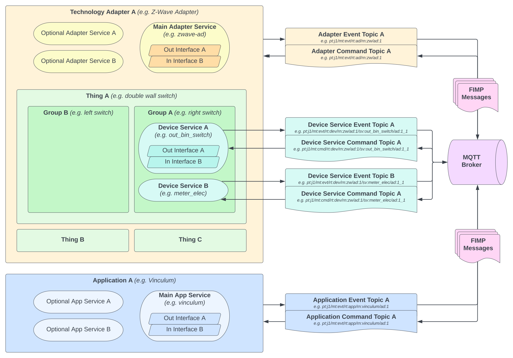

# FIMP - Futurehome IoT Messaging Protocol

## [(HTML version)](https://futurehomeno.github.io/fimp-api/#/)

## About

FIMP is a protocol of communication between IoT devices, adapters and applications built over MQTT standard.
It defines rules for message structure, topic naming conventions, as well as entities and their functionalities utilized in Futurehome IoT ecosystem.

## Overview

### Glossary

* **Application** is a software component that is responsible for managing certain aspect of the system.
  It contains one or more **services** which ought to be described in the application's own documentation.
  The FIMP protocol defines only best practices for [common interfaces](/common_interfaces/common_interfaces.md).
* **Adapter** is a software component that acts as an intermediary between the physical devices, called **things**, and the rest of the system.
  It must contain at least one main **service** which through its available **interfaces** is responsible for adding and removing things as well as monitoring their status.
  For more information see the [adapter](/adapter/adapter.md) section.
* **Thing** is a physical device that is connected to the system through an **adapter** and is composed out of one or more **groups**.
  A good example of a thing would be a physical double wall switch.
* **Group** consists of one or more device **services** and represents certain logical part of the thing, often representing a single *channel* also called a logical *device*.
  A good example would be a left or right switch in a double wall switch represented by a group of several **services**.
  Most notably *out_bin_switch* responsible for switching the relay and *meter_elec* responsible for electricity measurements.
* **Service** is logical bundle of one or more **interfaces** representing a certain domain of functionalities.
  In contrast to an adapter or an application service, a device service is accessible directly through its own dedicated topic.
  A good example of a service would be an *out_bin_switch* service containing interfaces responsible for setting, getting and reporting the switch state.
  While adapter and application services should be described in their own respective documentation, 
  all supported device services are described in the [device services](/device_services/README.md) chapter.
* **Interface** represents an atomic functionality of a service and is invoked directly in a FIMP message.
  A good example of an interface would be *cmd.binary.set* which is responsible for setting the state of a binary switch.
  For more information see [interface format](/fimp/message_format.md#interface-format) section.

### Communication

In FIMP communication between all entities is done through the **MQTT broker**.
The most important entities with which we can directly interact are technology **adapters** and **applications**.
Whenever a client, be it an adapter or an application, wants to send a command to another entity, it publishes it to a **topic** that is specific for this entity commands.
If it wants to receive a message from another entity, it subscribes to a **topic** that is specific for this entity events.
At any time any entity may publish an event in a response to a command or to broadcast information to all interested parties.
In order to discover all available entities, a client can utilize the [component discovery](/hub/component_discovery.md) mechanism.
Besides the adapters and applications it is also possible to communicate with the hub itself through a special [gateway service](/hub/gateway_service.md).

Each FIMP **topic** is constructed in a way that contains all the information needed to identify the entity and the type of the message.
For detailed rules governing topic naming rules see the [topic format](/fimp/topic_format.md) document.

Each FIMP **message** consist of a metadata envelope which contains all the details including involved service, interface and value type.
For detailed rules governing the message structure see the [message format](/fimp/message_format.md) document.
