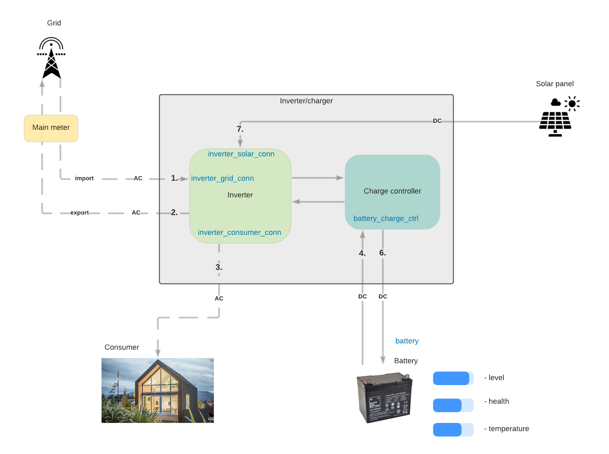

# Inverter Services

> **Important!** Inverter services are experimental and are subject to be removed or modified in a backwards in-compatible way.

An inverter device is normally composed of one or several inverter services.

## Service names

| Service name             | Description                                                 |
|--------------------------|-------------------------------------------------------------|
| `inverter_grid_conn`     | Represents inverter connection to the electric grid.        |
| `inverter_consumer_conn` | Represents the inverter connection to consumer's household. |
| `inverter_solar_conn`    | Represents the inverter connection to the solar panel.      |

## Interfaces

| Type | Interface                | Value type | Description                                                                     |
|------|--------------------------|------------|---------------------------------------------------------------------------------|
| out  | evt.meter_ext.report     | float_map  | Returns [extended meter report](/device_services/generic/meter.md#definitions). |
| in   | cmd.meter_ext.get_report | null       | Request the extended report.                                                    |
